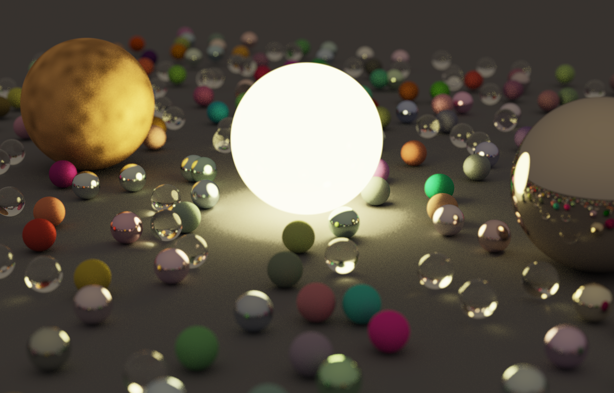

# CPU Ray Tracer

> A CPU-based Monte Carlo ray tracer built in modern C++, inspired by *Ray Tracing in One Weekend* and extended with cinematic rendering features including Depth of Field, procedural Value Noise texturing, HDR tone mapping, gamma correction, and Bloom post-processing.

<p align="center">


</p>

---

## Preview

<p align="center">
  
</p>

<p align="center">
  <em>High-resolution render featuring glossy metals, dielectric glass, Depth of Field, procedural Value Noise texturing, HDR rendering, and Bloom.</em>
</p>

---

## Features

| Feature                        | Description                                                                             |
| ------------------------------ | --------------------------------------------------------------------------------------- |
| 🎯 Monte Carlo Path Tracing    | Multi-sample stochastic rendering with recursive light transport.                       |
| 🌤️ Lambertian Diffuse         | Diffuse material with randomized scattering.                                            |
| ✨ Metallic Materials           | Reflective metal surfaces with adjustable roughness (`fuzz`).                           |
| 💎 Dielectric Glass            | Refraction, reflection, Total Internal Reflection, and Schlick's Fresnel approximation. |
| 💡 Emissive Materials          | Custom emissive surfaces that contribute radiance to the scene.                         |
| 🔥 Glowing Metal               | Custom material combining metallic reflection with emission.                            |
| 📷 Depth of Field              | Thin-lens camera model with controllable aperture and focal distance.                   |
| 🌄 HDR Rendering               | High dynamic range radiance accumulation before display processing.                     |
| 🎨 Reinhard Tone Mapping       | Compresses HDR radiance into a displayable range.                                       |
| 🌙 Gamma Correction            | Converts linear rendered colors into display-ready values.                              |
| 🟠 Procedural Value Noise      | Smooth procedural texture variation applied to the gold sphere.                         |
| 🔥 Bloom                       | Bright-pixel extraction followed by separable blur and HDR compositing.                 |
| 🎲 Stochastic Anti-Aliasing    | Randomized sub-pixel sampling for smoother edges.                                       |
| 🌌 Procedural Scene Generation | Randomized arrangement of diffuse, metallic, and dielectric spheres.                    |

---

## Render Gallery

<table>
<tr>
<td align="center">

**Final Scene**


</td>
</tr>
</table>

---

## Project Structure

```text
cpu_ray-tracer/
├── assets/          # Images used in the README
├── include/         # Camera, materials, geometry, vectors, and ray utilities
├── src/             # Main rendering pipeline
├── output/          # Rendered PPM images
├── extra/           # Additional helper files and notes
├── README.md
└── LICENSE
```

---

## Build & Run

### Compile

From the project root:

```bash
g++ -O3 -Iinclude src/main.cpp -o output/main.exe
```

### Run

```powershell
.\output\main.exe | Out-File output\image.ppm -Encoding ascii
```

The renderer produces a PPM image containing the final render.

The resulting image can be viewed with a compatible image viewer or converted to PNG using tools such as ImageMagick.

---

## Configuration

The main rendering and camera parameters can be adjusted in `src/main.cpp`.

| Parameter             | Purpose                                      | Current Value  |
| --------------------- | -------------------------------------------- | -------------- |
| `nx`                  | Output image width                           | `2500`         |
| `ny`                  | Output image height                          | `1600`         |
| `ns`                  | Samples per pixel                            | `150`          |
| Ray depth             | Maximum recursive ray-bounce depth           | `100`          |
| `look_from`           | Camera position                              | `(8, 4.5, 12)` |
| `look_at`             | Camera target                                | `(0, 0.2, 0)`  |
| `vfov`                | Camera vertical field of view                | `20.0f`        |
| `focus_dist`          | Depth-of-field focal distance                | `15.0f`        |
| `aperture`            | Camera lens aperture                         | `0.18f`        |
| Value Noise scale     | Spatial frequency of the gold-sphere texture | `6.0f`         |
| Value Noise variation | Strength of procedural color variation       | `0.5f`         |
| `bloom_threshold`     | Brightness threshold for bloom extraction    | `0.5f`         |
| `bloom_strength`      | Intensity of the bloom contribution          | `2.5f`         |

### Rendering Quality

The current high-quality configuration is:

```cpp
const int nx = 2500;
const int ny = 1600;
const int ns = 150;
```

For faster previews, reduce the resolution and number of samples:

```cpp
const int nx = 600;
const int ny = 400;
const int ns = 30;
```

Higher sample counts reduce Monte Carlo noise at the cost of increased rendering time.

The recursive ray depth is currently passed as:

```cpp
color(r, world, 100);
```

Increasing the ray depth allows more recursive scattering events, while increasing the sample count primarily reduces stochastic noise.

### Camera and Depth of Field

The current camera configuration is:

```cpp
vec look_from(8, 4.5, 12);
vec look_at(0, 0.2, 0);

float vfov = 20.0f;

const float focus_dist = 15.0f;
const float aperture = 0.18f;
```

The thin-lens camera produces depth-of-field blur by sampling different ray origins across the camera aperture. `focus_dist` determines the focal plane, while a larger aperture produces stronger defocus.

### Value Noise

The gold sphere uses procedural Value Noise with:

```cpp
scale = 6.0f;
variation = 0.5f;
```

Increasing the scale produces finer spatial variations, while increasing the variation makes the procedural texture more pronounced.

### Bloom

Bloom currently uses:

```cpp
const float bloom_threshold = 0.5f;
const float bloom_strength = 2.5f;
```

The renderer extracts pixels above the HDR brightness threshold, performs horizontal and vertical separable blur passes, repeats the blur process for a second pass, and composites the resulting glow back into the HDR framebuffer before tone mapping.

---

## Rendering Pipeline

The renderer processes each pixel through the following pipeline:

```text
                    Camera
                       │
                       ▼
              Primary Ray Generation
                       │
                       ▼
             Ray-Object Intersections
                       │
                       ▼
                Material Scattering
                       │
             ┌─────────┴─────────┐
             │                   │
             ▼                   ▼
         Reflection           Refraction
             │                   │
             └─────────┬─────────┘
                       ▼
                Recursive Tracing
                       │
                       ▼
                 HDR Radiance
                       │
                       ▼
                  Sample Average
                       │
                       ▼
                HDR Framebuffer
                       │
             ┌─────────┴─────────┐
             │                   │
             ▼                   ▼
        Original HDR       Bright-Pixel Mask
                                 │
                                 ▼
                         Horizontal Blur
                                 │
                                 ▼
                          Vertical Blur
                                 │
                                 ▼
                         Second Blur Pass
                                 │
                                 ▼
                       Bloom Composite
                                 │
                                 ▼
                       Reinhard Tone Map
                                 │
                                 ▼
                        Gamma Correction
                                 │
                                 ▼
                             Clamp
                                 │
                                 ▼
                           8-bit RGB
                                 │
                                 ▼
                           PPM Output
```

---

## Technical Highlights

### Reflection and Refraction

Metallic surfaces use reflected rays with controllable roughness. Dielectric surfaces combine reflection and refraction using Snell's law, with Schlick's approximation used to estimate the Fresnel reflection probability.

Total Internal Reflection is handled when refraction is no longer possible at sufficiently large incidence angles.

### Emissive Lighting

The renderer supports surfaces that emit radiance directly. The central glowing sphere uses a custom emissive metallic material, allowing it to combine metallic reflection with light emission.

### Depth of Field

The camera uses a thin-lens model. Primary rays originate from randomized positions across the lens aperture, producing defocus outside the selected focal plane.

### Procedural Value Noise

The gold sphere uses 3D procedural Value Noise to introduce smooth spatial variation into its material response. The texture is generated mathematically from the surface position rather than loaded from an image.

### HDR and Tone Mapping

Radiance is accumulated in floating-point HDR form throughout rendering. Reinhard tone mapping is applied after Bloom compositing to compress the dynamic range before conversion to display values.

### Bloom

Bright HDR pixels are extracted into a separate image, blurred using separable horizontal and vertical passes, processed through a second blur pass, and added back to the original HDR framebuffer. This preserves the bright core while producing a surrounding glow.

---

## Performance Notes

Rendering cost depends primarily on:

* Output resolution
* Samples per pixel
* Recursive ray depth
* Number of scene primitives
* Material complexity
* Depth-of-field sampling
* Bloom post-processing

The current configuration renders at `2500 × 1600` with `150` samples per pixel and prioritizes image quality and implementation clarity over aggressive acceleration.

---

## Inspiration

This project was inspired by Peter Shirley's *Ray Tracing in One Weekend* series.

The implementation extends the foundational ray-tracing concepts with custom scene composition, emissive materials, Depth of Field, procedural Value Noise texturing, HDR tone mapping, gamma correction, and Bloom post-processing.

---

## Future Work

Possible future CPU-side extensions include improved sampling, denoising, and additional procedural materials.

Advanced GPU acceleration and rendering techniques are being explored separately in the CUDA ray tracer project.

---

## License

This project is released under the **MIT License**.

See [`LICENSE`](LICENSE) for the complete license text.

---

## Acknowledgements

* Peter Shirley — *Ray Tracing in One Weekend*
* The broader computer graphics community for foundational ray-tracing and rendering techniques
